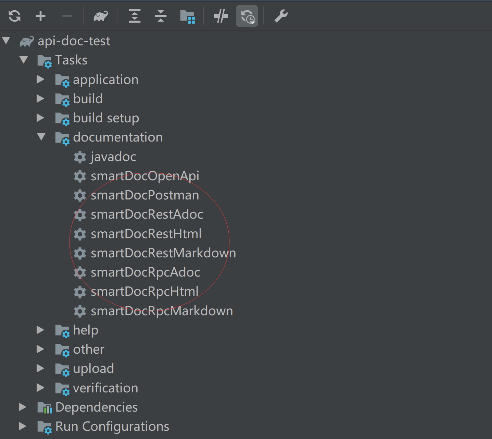

## Introduce
`smart-doc-gradle-plugin`是`smart-doc`官方团队开发的`gradle`插件，该插件从`smart-doc 1.8.6`版本开始提供，
使用`smart-doc-gradle-plugin`更方便用户集成到自己的项目中，集成也更加轻量，你不再需要在项目中编写单元测试来
启动`smart-doc`扫描代码分析生成接口文档。可以直接运行`gradle`命令
或者是`IDEA`中点击`smart-doc-gradle-plugin`预设好的`goal`即可生成接口文档。

[关于smart-doc](https://gitee.com/smart-doc-team/smart-doc)

## Getting started
### Add plugin
Using the plugins DSL:
```
plugins {
  id "com.github.shalousun.smart-doc" version "[最新版本]"
}
```
Using legacy plugin application:
```
buildscript {
    repositories {
        maven { url 'http://maven.aliyun.com/nexus/content/groups/public/' }
        maven { url = uri("https://plugins.gradle.org/m2/") }
        mavenCentral()
    }
    dependencies {
        classpath 'com.github.shalousun:smart-doc-gradle-plugin:[最新版本]'
    }
}
apply(plugin = "com.github.shalousun.smart-doc")
```

**`buildscript`配置添加到`build.gradle`的顶部** 。
### Plugin options
是`smart-do`c插件使用还需要在`build.gradle`添加一些常见本身的配置

| Option | Default value | Required| Description                                                                                     |
| ------ | ------------- | -------------|-------------------------------------------------------------------------------------------------|
|configFile|`src/main/resources/default.json`|`true`| 插件配置文件                                                                                          |
|exclude|无|`false`| 排除一些无法自动下载的`java lib sources`,例如:`exclude 'org.springframework.boot:spring-boot-starter-tomcat'` |
|include|无|`false`| 让插件自定下载指定的`java lib sources`,例如:`include 'org.springframework.boot:spring-boot-starter-tomcat'`   |

Example setting of options:
```
smartdoc {
    configFile = file("src/main/resources/smart-doc.json")
    
    // exclude example
    // exclude artifact
    exclude 'org.springframework.boot:spring-boot-starter-tomcat'
    // exclude artifact use pattern
    exclude 'org.springframework.boot.*'
    // 你可以使用include配置来让插件自动加载指定依赖的source.
    include 'org.springframework.boot:spring-boot-starter-tomcat'
}
```
对于多模块的`gradle`，把`smart-doc`插件相关配置放到根目录`build.gradle`的`subprojects`中。

```
subprojects{
    apply plugin: 'com.github.shalousun.smart-doc'
    smartdoc {
        //
        configFile = file("src/main/resources/smart-doc.json")
        // exclude artifact
        exclude 'org.springframework.boot:xx'
        exclude 'org.springframework.boot:ddd'
        // 你可以使用include配置来让插件自动加载指定依赖的source.
        include 'org.springframework.boot:spring-boot-starter-tomcat'
    }
}
```
多模块`smart-doc`的实战`demo`参考
```
https://gitee.com/smart-doc-team/smart-doc-gradle-plugin-demo
```
> 多模块和单模块项目是有区别，多模块不从根目录使用命令构建可能会导致模块间源代码加载失败，生成文档出现各种问题。
### Create a json config
在自己的项目中创建一个`json`配置文件，如果是多个模块则放到需要生成文档的模块中，`smart-doc-gradle-plugin`插件会根据这个配置生成项目的接口文档。
例如在项目中创建`/src/main/resources/smart-doc.json`。配置内容参考如下。

**最小配置单元:**
```
{
   "outPath": "D://md2" //指定文档的输出路径 相对路径时请写 ./ 不要写 / eg:./src/main/resources/static/doc
}
```
**详细配置说明:**
```
{
  "serverUrl": "http://127.0.0.1", //服务器地址,非必须。导出postman建议设置成http://{{server}}方便直接在postman直接设置环境变量
  "pathPrefix": "", //设置path前缀,非必须。如配置Servlet ContextPath 。@since 2.2.3
  "isStrict": false, //是否开启严格模式
  "allInOne": true,  //是否将文档合并到一个文件中，一般推荐为true
  "outPath": "D://md2", //指定文档的输出路径
  "coverOld": true,  //是否覆盖旧的文件，主要用于mardown文件覆盖
  "createDebugPage": true,//@since 2.0.0 smart-doc支持创建可以测试的html页面，仅在AllInOne模式中起作用。
  "packageFilters": "",//controller包过滤，多个包用英文逗号隔开，2.2.2开始需要采用正则：com.test.controller.*
  "md5EncryptedHtmlName": false,//只有每个controller生成一个html文件是才使用
  "style":"xt256", //基于highlight.js的代码高设置,可选值很多可查看码云wiki，喜欢配色统一简洁的同学可以不设置
  "projectName": "smart-doc",//配置自己的项目名称
  "skipTransientField": true,//目前未实现
  "sortByTitle":false,//接口标题排序，默认为false,@since 1.8.7版本开始
  "showAuthor":true,//是否显示接口作者名称，默认是true,不想显示可关闭
  "requestFieldToUnderline":true,//自动将驼峰入参字段在文档中转为下划线格式,//@since 1.8.7版本开始
  "responseFieldToUnderline":true,//自动将驼峰入参字段在文档中转为下划线格式,//@since 1.8.7版本开始
  "inlineEnum":true,//设置为true会将枚举详情展示到参数表中，默认关闭，//@since 1.8.8版本开始
  "recursionLimit":7,//设置允许递归执行的次数用于避免一些对象解析卡主，默认是7，正常为3次以内，//@since 1.8.8版本开始
  "allInOneDocFileName":"index.html",//自定义设置输出文档名称, @since 1.9.0
  "requestExample":"true",//是否将请求示例展示在文档中，默认true，@since 1.9.0
  "responseExample":"true",//是否将响应示例展示在文档中，默认为true，@since 1.9.0
  "urlSuffix":".do",//支持SpringMVC旧项目的url后缀,@since 2.1.0
  "displayActualType":false,//配置true会在注释栏自动显示泛型的真实类型短类名，@since 1.9.6
  "appKey": "20201216788835306945118208",// torna平台对接appKey,, @since 2.0.9
  "appToken": "c16931fa6590483fb7a4e85340fcbfef", //torna平台appToken,@since 2.0.9
  "secret": "W.ZyGMOB9Q0UqujVxnfi@.I#V&tUUYZR",//torna平台secret，@since 2.0.9
  "openUrl": "http://localhost:7700/api",//torna平台地址，填写自己的私有化部署地址@since 2.0.9
  "debugEnvName":"测试环境", //torna环境名称
  "debugEnvUrl":"http://127.0.0.1",//推送torna配置接口服务地址
  "tornaDebug":false,//启用会推送日志
  "ignoreRequestParams":[ //忽略请求参数对象，把不想生成文档的参数对象屏蔽掉，@since 1.9.2
     "org.springframework.ui.ModelMap"
   ],
  "dataDictionaries": [{ //配置数据字典，没有需求可以不设置
      "title": "http状态码字典", //数据字典的名称
      "enumClassName": "com.power.common.enums.HttpCodeEnum", //数据字典枚举类名称
      "codeField": "code",//数据字典字典码对应的字段名称
      "descField": "message"//数据字典对象的描述信息字典
  }],
  "errorCodeDictionaries": [{ //错误码列表，没有需求可以不设置
    "title": "title",
    "enumClassName": "com.power.common.enums.HttpCodeEnum", //错误码枚举类
    "codeField": "code",//错误码的code码字段名称
    "descField": "message"//错误码的描述信息对应的字段名
  }],
  "revisionLogs": [{ //文档变更记录，非必须
      "version": "1.0", //文档版本号
      "revisionTime": "2020-12-31 10:30", //文档修订时间
      "status": "update", //变更操作状态，一般为：创建、更新等
      "author": "author", //文档变更作者
      "remarks": "desc" //变更描述
    }
  ],
  "customResponseFields": [{ //自定义添加字段和注释，一般用户处理第三方jar包库，非必须
      "name": "code",//覆盖响应码字段
      "desc": "响应代码",//覆盖响应码的字段注释
      "ownerClassName": "org.springframework.data.domain.Pageable", //指定你要添加注释的类名
      "ignore":true, //设置true会被自动忽略掉不会出现在文档中
      "value": "00000"//设置响应码的值
  }],
  "customRequestFields": [{ //自定义请求体的注释，@since 2.1.3，非必须
       "name":"code", //属性名
       "desc":"状态码", //描述
       "ownerClassName":"com.xxx.constant.entity.Result", //属性对应的类全路径
       "value":"200", //默认值或者mock值
       "required":true, //是否必填
       "ignore":false //是否忽略
  }],
  "requestHeaders": [{ //设置请求头，没有需求可以不设置
      "name": "token",//请求头名称
      "type": "string",//请求头类型
      "desc": "desc",//请求头描述信息
      "value":"token请求头的值",//不设置默认null
      "required": false,//是否必须
      "since": "-",//什么版本添加的改请求头
      "pathPatterns": "/app/test/**",//请看https://gitee.com/smart-doc-team/smart-doc/wikis/请求头高级配置?sort_id=4178978
      "excludePathPatterns":"/app/page/**"//请看https://gitee.com/smart-doc-team/smart-doc/wikis/请求头高级配置?sort_id=4178978
  },{
      "name": "appkey",//请求头
      "type": "string",//请求头类型
      "desc": "desc",//请求头描述信息
      "value":"appkey请求头的值",//不设置默认null
      "required": false,//是否必须
      "pathPatterns": "/test/add,/testConstants/1.0",//正则表达式过滤请求头,url匹配上才会添加该请求头，多个正则用分号隔开
      "since": "-"//什么版本添加的改请求头
  }],
  "rpcApiDependencies":[{ // 项目开放的dubbo api接口模块依赖，配置后输出到文档方便使用者集成
        "artifactId":"SpringBoot2-Dubbo-Api",
        "groupId":"com.demo",
        "version":"1.0.0"
   }],
  "rpcConsumerConfig": "src/main/resources/consumer-example.conf",//文档中添加dubbo consumer集成配置，用于方便集成方可以快速集成
  "apiObjectReplacements": [{ // 自smart-doc 1.8.5开始你可以使用自定义类覆盖其他类做文档渲染，非必须
      "className": "org.springframework.data.domain.Pageable",
      "replacementClassName": "com.power.doc.model.PageRequestDto" //自定义的PageRequestDto替换Pageable做文档渲染
  }],
  "apiConstants": [{//从1.8.9开始配置自己的常量类，smart-doc在解析到常量时自动替换为具体的值，非必须
        "constantsClassName": "com.power.doc.constants.RequestParamConstant"
  }],
  "responseBodyAdvice":{ //自smart-doc 1.9.8起，非必须项，ResponseBodyAdvice统一返回设置(不要随便配置根据项目的技术来配置)，可用ignoreResponseBodyAdvice tag来忽略
       "className":"com.power.common.model.CommonResult" //通用响应体
  },
  "requestBodyAdvice":{ ////自smart-doc 2.1.4 起，支持设置RequestBodyAdvice统一请求包装类，非必须
       "className":"com.power.common.model.CommonResult"
  }
}
```
**注意：** 上面的`json`配置完全使用`smart-doc`的`ApiConfig`转化成`json`而来。因此项目配置也可以参考`smart-doc`的介绍。

使用可参考[【smart-doc-gradle-plugin集成demo】](https://gitee.com/smart-doc-team/smart-doc-gradle-plugin-demo)
### Generated document
#### Use Gradle command
```
//生成html
gradle smartDocRestHtml
//生成markdown
gradle smartDocRestMarkdown
//生成adoc
gradle smartDocRestAdoc
//生成postmanjson数据
gradle smartDocPostman
//生成Open Api 3.0 +规范的json文档,since smart-doc-gradle-plugin 1.1.4
gradle smartDocOpenApi
//生成rest接口文档并推送到Torna平台,@since 2.0.9
gradle tornaRest

// Apache Dubbo Rpc生成
// Generate html
gradle smartDocRpcHtml
// Generate markdown
gradle smartDocRpcMarkdown
// Generate adoc
gradle smartDocRpcAdoc
// 推送rpc接口到torna中
gradle tornaRpc
```
#### Use IDEA
当你使用`Idea`时，可以通过`Gradle Helper`插件选择生成何种文档。



# 插件源码
https://gitee.com/smart-doc-team/smart-doc-gradle-plugin

# gradle多模块构建配置参考
[【smart-doc-gradle-plugin集成demo】](https://gitee.com/smart-doc-team/smart-doc-gradle-plugin-demo)